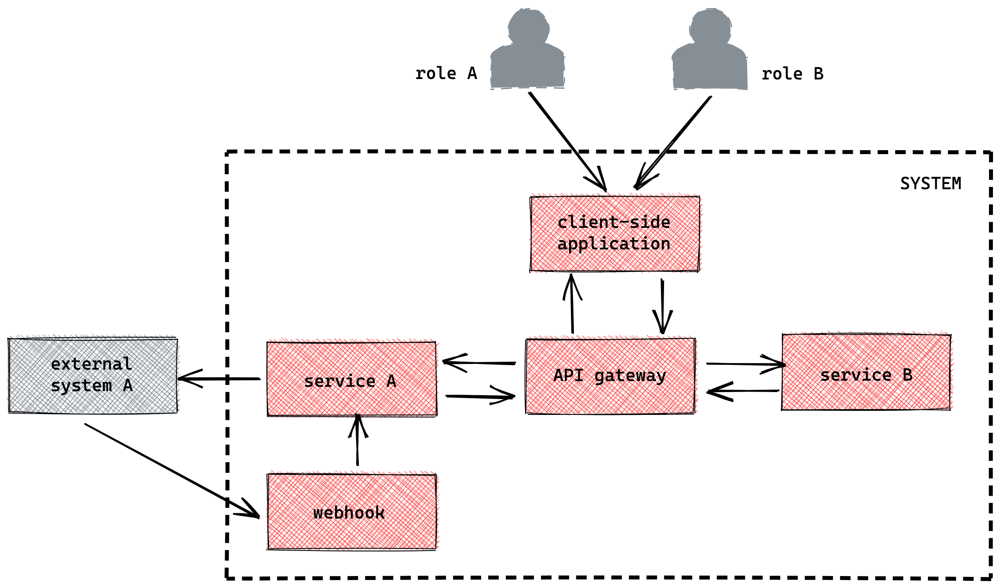
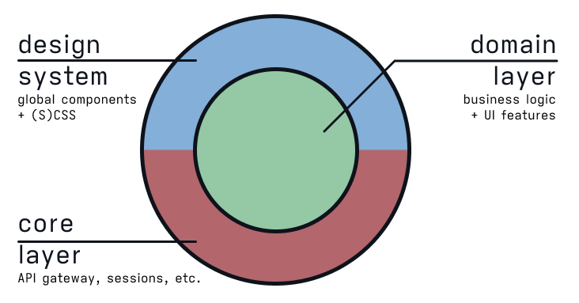
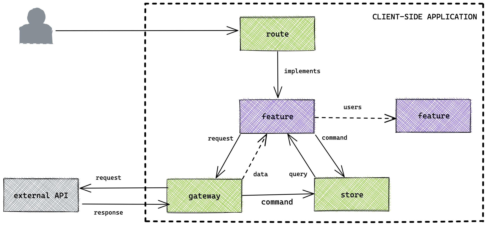
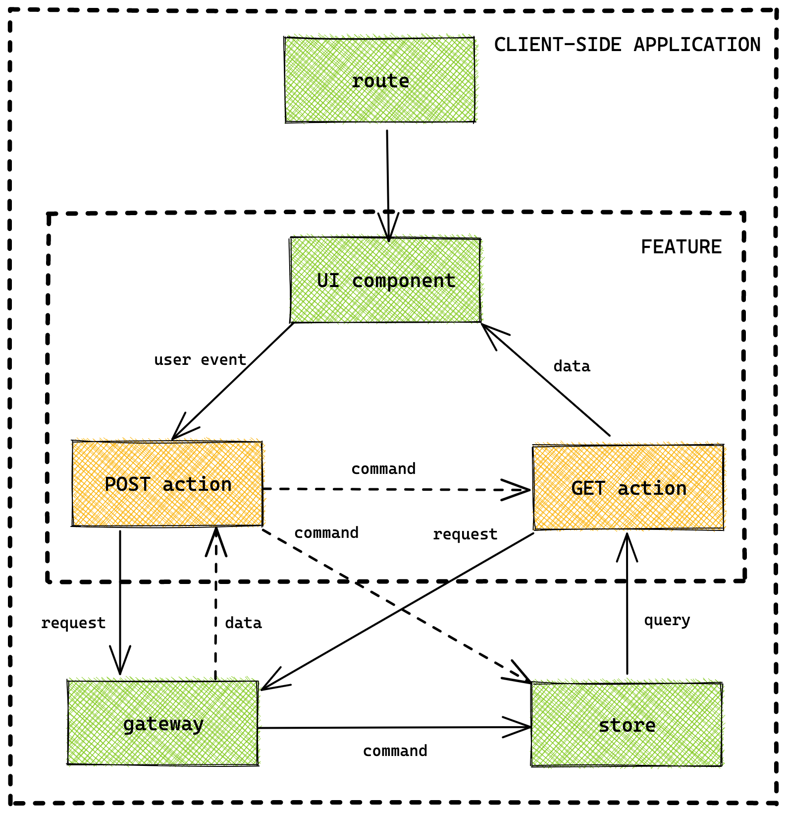
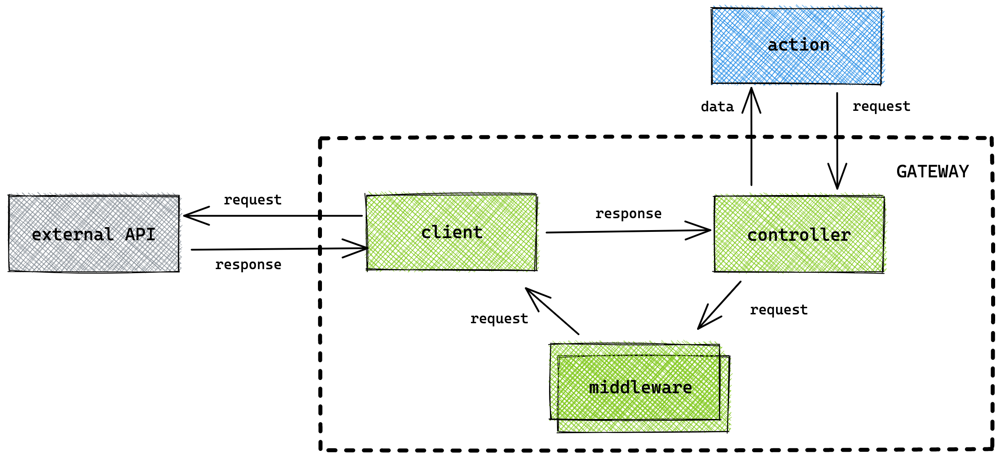
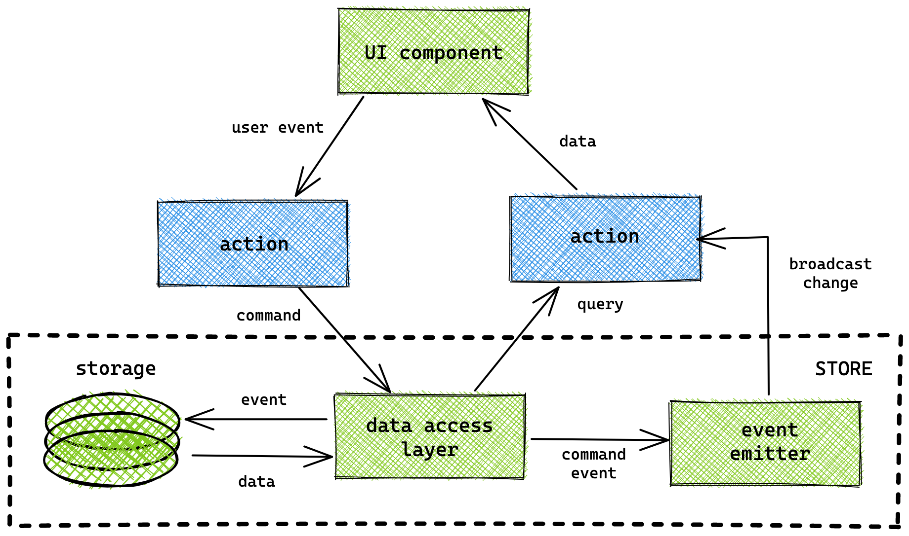

# Client-side software design

**2022 version** | **Author**: Kevin Pennekamp | front-end architect | [crinkles.io](https://crinkles.io) | <hello@crinkles.io>

This document describes the concepts and guidelines around client-side software design for digital enterprise applications. It shows how what is important to focus on, and how to apply structure. The goals of this document can be deduced to three goals.

- **Enable agility**. A good architecture helps you to embrace change from different angles (technology, business, requirements, etc.). This helps you further minimize the cost of change.
- **Minimize cost of change**. Create testable and maintainable code, and look ahead of what might come. A good architecture and a set of guidelines allows for easier technology decisions and change it along the way.
- **Shared understanding**. Modern client-side libraries do not offer guidelines on structure and organizing code. This requires a shared language of architectural patterns.

## Context & concepts

Client-side applications are almost always part of a bigger system. The systems we create comprise many internal and external/public services. Client-side applications connect to internal services through the published APIs of the system. The [C4 model](https://c4model.com) container diagram (or level 2) is displayed below.



Due to this place in a system, the concepts of a client-side application differ from the other containers in the system. The client-side application focuses on:

- Communicating with external APIs.
- Invoking and handling user events.
- Interact with the OS (e.g. browser, iOS).
- State management inside the application.

## Design principles

A reference architecture is an abstract blueprint for a specific class of information systems. It describes a set of guidelines on how to design an application architecture. It shows core components, the interrelationships among them, and their essential attributes.

This reference architecture is a guideline for designing client-side application. It offers framework-agnostic principles focused on the architecture behind the user interface. It applies to single-page, server-side rendered, and component-based mobile applications (e.g. React Native).

### Separation of concerns

The first and most important principle is _separation of concerns_. It is the activity of enforcing logical boundaries between each of the architectural concerns. It allows for _maintainable_ and _testable_ code.

A common method is the [clean architecture](https://blog.cleancoder.com/uncle-bob/2012/08/13/the-clean-architecture.html). The UI is in the original outer layer of the clean architecture. But, modern client-side frameworks make client-side applications more like traditional applications. Thus several layers can apply to client-side applications, as displayed below.



The three depicted layers show us the first level of separation. The separation helps us to understand how users interact with our code. But it also shows how our code interacts with the browser and external APIs.

- **Infrastructure**: all interface-related code (UI, browser APIs, and external APIs). The implementation is often abstracted into adapters (e.g. `Axios` or `React`).
- **Application**: describes all (user) interactions (e.g. clicking a submit button). Often called features, use-cases, actions, or operations.
- **Domain**: holds all business domain-related logic required for the UI (e.g. validation). Most domain logic lives elsewhere in the system.

> **NOTE**: separation of concerns can also be applied to separating styles, i.e. CSS, from logic. More information about CSS architecture can be found [here](https://crinkles.io/writing/my-css-architecture).

### Command-query separation (CQS)

The operations can be further separated using [command-query separation (CQS)](https://en.wikipedia.org/wiki/Command%E2%80%93query_separation). This pattern describes how to split read and write operations. _Queries_ only return data and don't impact state. _Commands_ change the state, but do not return data.

By splitting commands and queries, a client-side application becomes _reactive_. One component can subscribe to an application store through a query. Another component updates the store through a command, invoking change in the first component.

This pattern allows for the `stale-while-revalidate` caching strategy. When executing a query, the store serves a cached version first. If the cached version is 'invalid', the operation sends a new request. Upon receiving the response, the store updates and broadcasts the changes. Commands touching records in the store, invalidate those records (e.g. [optimistic UI](https://www.smashingmagazine.com/2016/11/true-lies-of-optimistic-user-interfaces/)).

### Co-location

Even when applying the first two principles, large client-side applications can become unmaintainable. [Co-location](https://kentcdodds.com/blog/colocation) describes that code and data should live close to where it is used. This allows for better developer experience, but above all, better maintainability of applications. The co-location principle is like the idea of [screaming architecture](https://blog.cleancoder.com/uncle-bob/2011/09/30/Screaming-Architecture.html). This describes that the general structure of your architecture should show the purpose of the application.


## Proposed project structure 

Let's look at the proposed project structure for a single-page React application. The explained clean architecture is not directly derivable from this project structure, but it does exist. The proposed directory match the architecture illustrated in the previous section. For clarification, each directory is provided with an indicator which layer they belong to.  

```
src/
├── components/       // (I) generic UI components
├── config/           // (I) env. configuration
├── constants/        // (A) global constants
├── features/         // (D/A) feature/domain-based modules
├── gateway/          // (I) wrapper + middleware around fetch
├── helpers/          // (A) generic utility functions
├── routes/           // (I) pages + router
├── stores/           // (I) global state management
├── styles/           // (I) all your scss code
└── index.js          // (I) App wrapper + router
```

This project structure cannot be applied within all languages and frameworks. But, the division can be used. Within SvelteKit, you can move almost everything into the predefined `lib` folder.

## Domain & application layers

On a high level, a user visiting the application will land on a specific route. This can be route in single-page application, a page on a mobile application, or a route of a SSR-framework. Each route combines one or more *features* accessible to the user. Features are the primary way to implement the domain and application layer. Each feature has the ability to use other features, or use several elements from the infrastructure layer. 



Within a feature, the co-location principle is heavily applied, as shown in the structure example below. Each feature consists of a mix of logic, styling and components. It is possible to divide features even further. In this case, it is possible to create a `todos/create` and `todos/overview` feature. 

```
src/
├── features/
│   ├── activities/
│   ├── todos/
│   │   ├── __tests__/
│   │   ├── update.action.js
│   │   ├── get.action.js
│   │   ├── todos.validation.js
│   │   ├── todos.store.js
│   │   ├── UpdateModal.jsx
│   │   ├── OverviewTable.jsx
│   │   ├── todos.module.scss
```

A good example of a feature is an 'update' feature, like in the project structure below. For an update feature, we need multiple *actions*. First need to retrieve the todo we want to update. But, we also need an action to send a `POST` request. The below diagram shows how the feature interactions with different other elements in the architecture. 



In the above diagram you can see how the CQS-principle is applied. It also shows how actions within a feature can interact. After a `POST` request, the action invokes a command both with the store and the `GET` action. One to update the local cache, and the other to invoke a refetch of the remote cache. 

## Infrastructure layer

The infrastructure layer in the clean architecture is the layer most subjected to change. In client-side applications it is dependent on the choice of technology. Various frameworks exist for the UI (e.g. React and Vue) and many more will come into play in coming years. On the other end, new API technologies like GraphQL are gaining in popularity. Because of this nature, adapters are used to stabilize the implementation.

This document describes either how to implement a mature adapter, or conceptually look at elements from the infrastructure layer.

### Gateway

The API gateway enables a consistent way to connect various external sources or APIs (e.g. REST and GraphQL). It includes a _client_ (e.g. `Axios` client, or just the browser fetch API) that sends out the requests. Each request goes through a chain of *middleware*. A middleware is a [_decorator_](https://www.oreilly.com/library/view/learning-javascript-design/9781449334840/ch09s14.html) that enhances each request (e.g. add authentication information).



> **NOTE**: many open-source API clients implement a similar structure (e.g. [Apollo Client](https://www.apollographql.com/client/))

Each request, regardless of the related external source, first goes through a _controller_. It allows for the sharing of generic logic between different clients of different external sources. This facade handles:

- Implement logic for authentication information refreshing. If a refresh request is in flight, it queues all other requests until the refresh request is finished.
- Send requests to the correct middleware and client.
- Handle the `stale-while-revalidate` in conjunction with the *action* that invoked the request.

### State management

In modern client-side applications, there are four different types of state that can be managed. The distinction of these different types is required, as each of these can be solved differently and in different areas of the clean architecture. 

- **UI**: state that is used by a single, or a set of UI components. It is used to control what we can see, how we interact (e.g. input fields) on a detail level. UI state is managed in the domain or application layer.
- **Remote**: state from the server that is cached on the client for quick and easy access for all UI components. The remote state should not deviate from the server, except when applying optimistic UI. Remote state is managed in the domain layer.
- **URL**: information stored in the URL, like object IDs or filter information, that can be used to determine what to render, or what information to retrieve from the cache/server on (initial) rendering of the page. URL state is managed in the infrastructure layer. 
- **Meta**: known as 'state about state'. A common example is a loading state around fetch requests. Meta state is managed in the domain layer. 

 > More information about state management in general can be found [here](https://crinkles.io/writing/state-management).

According to the co-location principle data should live close to where it is used. This means that features or feature-groups can have a store that manages state of their own. But, state can also live on a global or application level. The recommendation is that any store store that goes beyond single values or objects is _event-driven_ and _immutable_.



To follow the principles of this architecture, it uses an *access layer*. This *element* is an [*facade*](https://en.wikipedia.org/wiki/Facade_pattern) and decouples the state interface, allowing for better composability. Decoupled stores can be achieved by having a library that allows to register commands/queries on the access layer. Another way to create a decoupled store is to allow for multiple stores to live on the same level (e.g. dedicated stores on the global level).  

> **NOTE**: Many existing global state management packages like [Redux](https://redux.js.org/style-guide/style-guide) have a coupled state interface. They need to be configured centrally, instead of near the features.

An action triggers a command and the access layer updates the _storage_ based on the command. The access layer sends an event to an integrated event emitter. The emitter broadcasts the change to all actions subscribed to these events.

### UI components

Every system has these generic components that you see coming back. Buttons, input fields, tables, you name it. These components are called *foundational* components. Foundational components exist in four different categories.

- **Form**: input, buttons, checkboxes.
- **Navigation**: link, tabs, breadcrumbs, pagination.
- **Structure**: footer, accordion, table.
- **Utilities**: toast, dialog, tooltip.

Next to foundational components you have *application* components. These are non-generic components. They cannot be shared between applications. They are often a combination of foundational components, or deviate from the foundational rules. No pre-defined categories exist for these components, but you can make them based on common sense.

 > More information about the UI component anatomy can be found [here](https://crinkles.io/writing/ui-component-anatomy), and more information about CSS architecture and design systems can be found [here](https://crinkles.io/writing/my-css-architecture).


