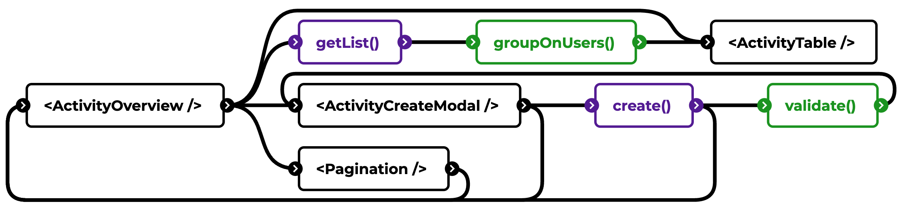

# Feature example: activity overview + create

> Black = component/page, purple = action, green = model.



**NOTE**: several dependencies can be missing from the above illustration. These are generic components that are view-only. `Pagination` is also a generic component that is visualised given its interaction with `ActivityOverview`.

```
features/
├── activities/
│   ├── __tests__/
│   ├── components/
│   │   ├── ActivityOverview.jsx
│   │   ├── ActivityTable.jsx
│   │   ├── ActivityCreateModal.jsx
│   ├── actions/
│   │   ├── create.activity.js
│   │   ├── getList.activity.js
│   ├── models/
│   │   ├── validate.activity.js
│   │   ├── groupOnUser.activity.js
```

**Components**

```jsx
// ActivityOverview.jsx
export default function ActivityOverview({ users }) {
	const [paging, setPaging] = useState({ page: 0, pageSize: 10 });
	const { activities, refresh } = useGetActivities(paging);
	const [showCreateModal, setModal] = useState(false);

	return (
		<div>
			<h1>Activities</h1>
			<button onClick={() => setModal(true)}>Create</button>
			<ActivityTable activities={activities} />
			<Pagination {...paging} onChange={setPaging} />
			{showCreateModal && (
				<ActivityCreateModal
					onClose={() => setModal(false)}
					onComplete={refresh}
				/>
			)}
		</div>
	);
}
```

- Responsible to determine if the create modal needs to be shown or not
- Responsible to hold the actual pagination state (as it is needed for `useGetActivities`)
- Responsible to hold the list of activities and feed it to the table (incl. updating)

```jsx
// ActivityCreateModal
export default function ActivityCreateModal({ onClose, onComplete }) {
	const [create, isLoading] = useCreateActivity();
	const [data, setData] = useState({});
	const [errors, setErrors] = useState();

	function onSubmit() {
		const [result, errors] = await create(data);
		if (errors) setErrors();
		else {
			onComplete();
			onClose();
		}
	}

	return (...);
}
```

- Responsible to hold state of the form
- Responsible to show validation errors
- Responsible to make the network call

**Actions**
Below an example of how a simple “get a single item based on ID” could look like, without the use of any library. In most cases you can use wrappers to make them more maintainable.

In this case, there is a generic `useQuery` wrapper that takes in an `async` function and an object of arguments. This wrapper hooks the outcome of the async function to React. The actual business logic is separated from the UI code, and can be tested as such.

```js
// Generic (simple) useQuery function
function useQuery(query, args) {
	const [results, setResults] = useState({
		data: null,
		isLoading: false,
		errors: null,
	});

	async function refresh() {
		setResults((r) => ({ ...r, isLoading: true }));
		const [data, errors] = await query(args);
		setResults((r) => ({ ...r, isLoading: false, data, errors }));
	}

	useEffect(() => {
		if (results.isLoading) return;
		refresh();
	}, [args]);

	return { ...results, refresh };
}

//get.activity.js
async function getActivity({ id }) {
	try {
		const res = await fetch(`${url}/${id}`);
		// e.g. more data transformation here, or grouping after multiple fetches
		return [await res.json(), null];
	} catch (e) {
		return [null, e];
	}
}

export function useGetActivity({ id }) {
	return useQuery(getActivity, { id });
}
```

Another example is the create command below. Again a generic wrapper is created that links an async function to React. The business logic is separated again to make it easily tested.

```js
// Generic useCommand hook
function useCommand(command) {
	const [isLoading, setLoading] = useState(false);

	async function handler(...args) {
		setLoading(true);
		const [res, error] = await fn(...args);
		setLoading(false);
	}
	return [handler, isLoading];
}

// create.activity.js
async function createActivity(data) {
	try {
		const errors = validateActivity(data);
		if (errors) return [null, errors];
		const res = await fetch(...);
		return [await res.json(), null];
	} catch (e) {
		return [null, e];
	}
}

export function useCreateActivity() {
	return useCommand(createActivity);
}
```
