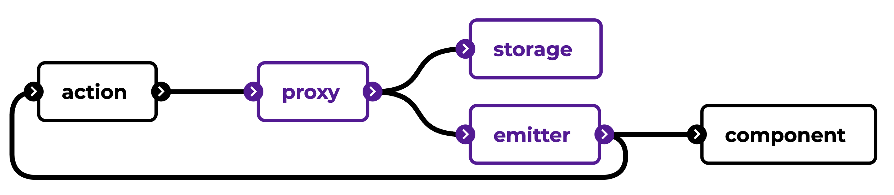

# Proxy store

> See [state management](../guidelines/state-management.md) for generic information about state management, or [kevtiq/chifferobe](https://github.com/kevtiq/chifferobe) for an example implementation

State can also live on a global or application level. The recommendation is that any store store that goes beyond single values or objects is _event-driven_ and _immutable_.

To follow the principles of this architecture, it uses a _proxy_ or _access layer_. This decouples the state interface. It provides an API (e.g. named actions) that can be used to access and mutate data. In addition, there is an _emitter_ that broadcasts any changes to the storage to features described to it.
