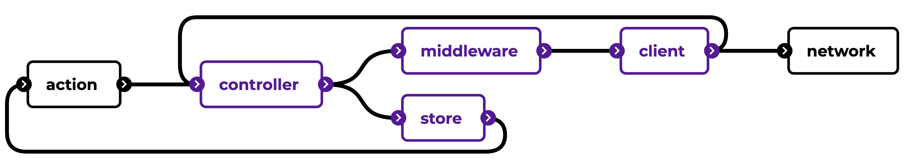

# Client-side API gateway

The API gateway enables a consistent way to connect various external sources or APIs (e.g. REST and GraphQL). It includes a _client_ (e.g. `Axios` client, or just the browser fetch API) that sends out the requests. Each request goes through a chain of _middleware_. A middleware is a [_decorator_](https://www.oreilly.com/library/view/learning-javascript-design/9781449334840/ch09s14.html) that enhances each request (e.g. add authentication information).

**NOTE**: many open-source API clients implement a similar structure (e.g. [Apollo Client](https://www.apollographql.com/client/))

Each request, regardless of the related external source, first goes through a _controller_. It allows for the sharing of generic logic between different clients of different external sources. This facade handles:

- Implement logic for authentication information refreshing. If a refresh request is in flight, it queues all other requests until the refresh request is finished.
- Send requests to the correct middleware and client.
- Handle the `stale-while-revalidate` in conjunction with the _action_ that invoked the request.
