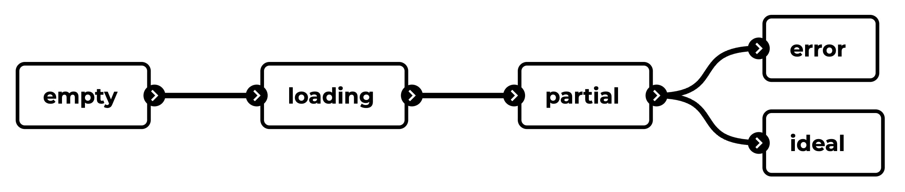
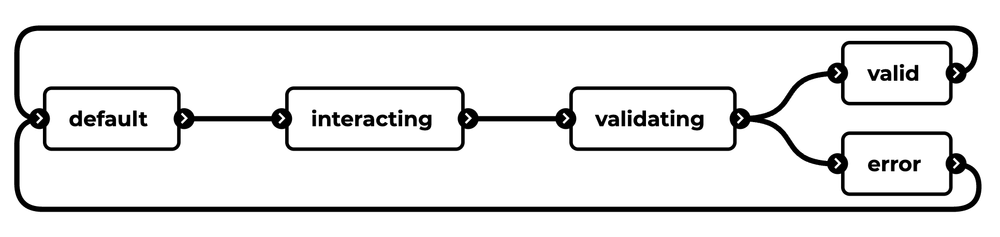

# UI states

## Application/UI states

- **Ideal**: shows maximum value of the feature/product/page
- **Empty**: no results found, first-time using, user cleared data (e.g. empty inbox)
- **Partial**: one row of data, incomplete profile, partial data loaded
- **Loading**: show that (partial) data is loading, or communication is happening
- **Error**: error in API connection, missing data

## Interaction states

- During validating interactive elements are disabled
- Interacting examples:
  - **Form**: editing & submitting
  - **Buttons**: hover & click
